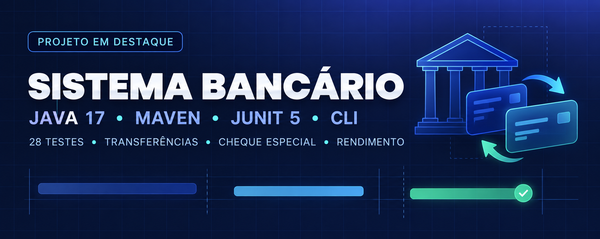

# 🏦 Sistema Bancário em Java



<p align="center">
  
  
  
  
</p>

**Sistema Bancário em Java** é uma aplicação de linha de comando que simula operações com contas
corrente e poupança. O projeto aplica fundamentos de Java, orientação a objetos, validações de
regras de negócio e testes unitários.

[Explore o código](src/main/java/com/github/amandadamata/sistemabancario/) ·
[Veja os testes](src/test/java/com/github/amandadamata/sistemabancario/)

## 📌 Sobre o projeto

Desenvolvido como projeto de estudo e portfólio, o sistema permite criar contas e realizar
operações bancárias pelo terminal. A implementação concentra-se na modelagem das entidades, no
tratamento de operações inválidas e na verificação das regras de negócio.

## ✨ Funcionalidades

- Cadastro de contas corrente e poupança
- Depósitos e saques com validação de valores
- Transferências entre contas
- Consulta de extrato com data, hora e saldo após cada operação
- Listagem de contas e saldos
- Uso de cheque especial em conta corrente
- Aplicação de rendimento de 0,5% em conta poupança
- Menu interativo com tratamento de entradas inválidas

## 🛠️ Tecnologias e conceitos aplicados

### Tecnologias

- **Java 17** como linguagem principal
- **Maven** para automação de build e gerenciamento de dependências
- **JUnit 5** para testes automatizados
- **Git e GitHub** para versionamento e publicação do código

### Conceitos

- Programação orientada a objetos
- Encapsulamento, abstração, herança e polimorfismo
- Coleções com `List` e `ArrayList`
- Exceção personalizada e tratamento de erros
- Validação de dados de entrada e regras de negócio
- Testes unitários e parametrizados

## 📁 Estrutura do projeto

```text
.
├── src/
│   ├── main/java/com/github/amandadamata/sistemabancario/
│   │   ├── Main.java
│   │   ├── Banco.java
│   │   ├── Cliente.java
│   │   ├── Conta.java
│   │   ├── ContaCorrente.java
│   │   ├── ContaPoupanca.java
│   │   ├── Transacao.java
│   │   └── SaldoInsuficienteException.java
│   └── test/java/com/github/amandadamata/sistemabancario/
│       ├── BancoTest.java
│       ├── ClienteTest.java
│       └── ContaTest.java
├── assets/
│   └── sistema-bancario-banner.png
├── pom.xml
└── README.md
```

## ▶️ Como executar

Pré-requisitos: JDK 17 ou superior e Maven.

```bash
git clone https://github.com/Amandadamata/sistema-bancario-java.git
cd sistema-bancario-java
mvn clean package
java -jar target/sistema-bancario-java-1.0.0.jar
```

## 🧪 Testes

```bash
mvn test
```

A suíte atual executa 28 testes sobre cadastro, operações financeiras, cheque especial,
transferências, rendimento e validações de dados e valores.

## 🚧 Status e limitações

O projeto está funcional para o escopo educacional atual.

- Os dados permanecem apenas em memória e são reiniciados ao encerrar a aplicação.
- Os valores monetários usam `double`; uma evolução natural é adotar `BigDecimal` e regras
  explícitas de arredondamento.
- O CPF é tratado como campo obrigatório, sem validação de formato ou dígitos verificadores.
